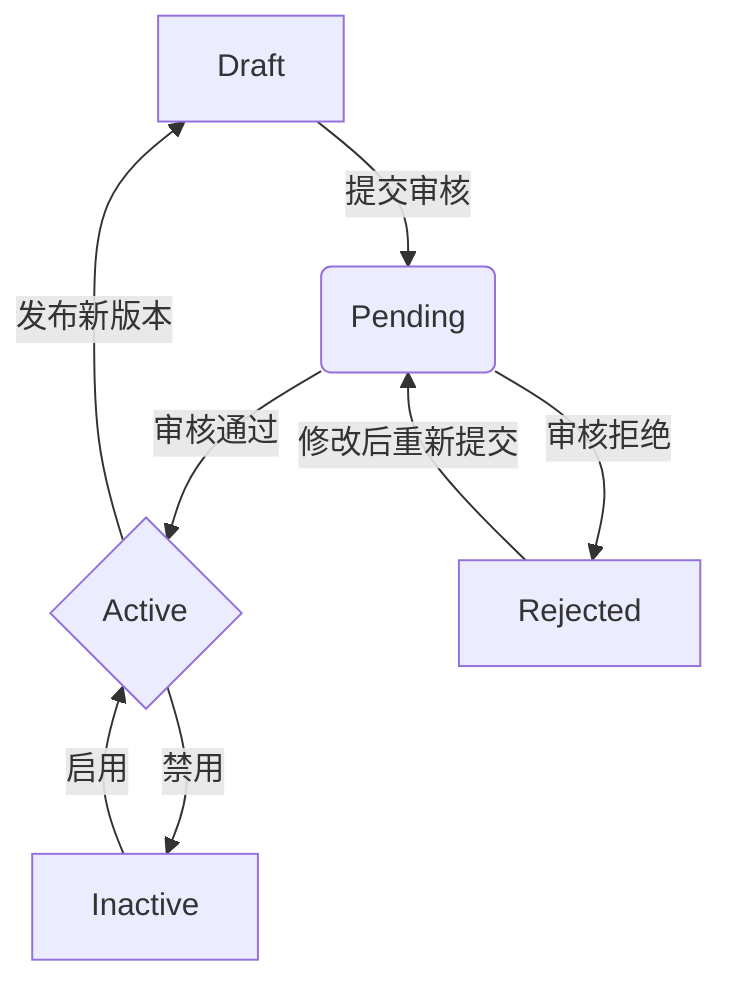

# 插件化架构方案：代码上传与安全执行

**版本**: v7.0  
**作者**: Manus AI  
**日期**: 2026-01-08

---

## 1. 风险分析与核心挑战

用户提出的“代码上传执行”模式，与传统的远程API对接相比，是一种集成度更高的插件化方案。第三方开发者将代码包上传至中台，由中台负责部署和执行。这种模式虽然能提供更灵活、更深入的功能扩展，但其核心挑战在于**安全性和隔离性**。

我们必须假设所有第三方代码都是**不可信的**。因此，首要任务是构建一个强大的沙箱（Sandbox）环境，防止插件代码执行恶意操作，例如：

- **访问宿主机文件系统**：窃取敏感配置或数据。
- **访问网络**：向外部发送数据或攻击内部网络服务。
- **无限占用资源**：通过死循环或内存溢出攻击，耗尽CPU和内存，导致主服务瘫痪。
- **执行危险的系统调用**：如`fork`炸弹、修改系统时间等。

## 2. 技术选型：沙箱方案对比

为了在Go环境中安全地执行不受信任的代码，我们调研了多种技术方案。核心思路是在不同层级上进行隔离。

| 方案 | 代表技术 | 隔离级别 | 优点 | 缺点 |
| :--- | :--- | :--- | :--- | :--- |
| **原生插件** | Go `plugin` 包 | 进程内 | 性能高，与主程序集成紧密 | 安全性极差，插件崩溃会导致主程序崩溃，版本依赖严格 |
| **RPC插件** | `hashicorp/go-plugin` | 进程级 | 跨进程隔离，主程序更稳定，语言无关 | 无法限制插件的系统级权限（如文件、网络访问） |
| **系统调用过滤** | `seccomp-go`, `ptrace` | 内核级 | 精细控制系统调用，安全性高 | 配置复杂，容易误杀正常操作，跨平台性差 |
| **容器化沙箱** | Docker, gVisor | 容器/内核级 | 强大的文件、网络、进程隔离，成熟的资源限制 | 资源开销大，冷启动慢，环境复杂 |
| **专用沙箱工具** | `ioi/isolate` | 容器+cgroups | **最佳选择**：专为安全执行代码设计，提供精细的资源和权限控制，比完整Docker更轻量 |

**结论**：综合考虑安全性、资源控制和实现复杂度，**`ioi/isolate`** 是最适合我们场景的沙箱技术。它在安全性和性能之间取得了很好的平衡，被广泛用于在线编程竞赛平台，足以应对执行不可信代码的挑战。

## 3. 初步架构思路：基于`isolate`的沙箱执行服务

我们将借鉴[这篇技术文章](https://blog.stackademic.com/building-golang-api-to-run-untrusted-code-in-sandbox-88d9460529f8)中提出的方案，构建一个沙箱执行服务。

**核心设计**：

1.  **沙箱池（Sandbox Pool）**：主服务启动时，使用`isolate`预先创建一组独立的沙箱环境（例如，10个Box）。每个沙箱都是一个被严格限制的Linux容器环境。
2.  **任务分发**：当需要执行一个插件功能时，从沙箱池中取出一个“空闲”的沙箱。
3.  **代码注入与执行**：
    *   将用户上传的Go代码（例如 `plugin.go`）保存为临时文件。
    *   通过`isolate`的参数，将该代码文件挂载到选定的沙箱内部。
    *   在沙箱内执行`go run plugin.go`命令。
4.  **资源限制**：`isolate`工具本身提供了丰富的参数来限制每个沙箱的资源，包括：
    *   **CPU时间** (`--time`)
    *   **内存使用** (`--mem`)
    *   **进程数量** (`--processes`)
    *   **文件大小** (`--fsize`)
    *   **网络访问** (默认禁止)
5.  **结果返回**：通过`stdout`和`stderr`捕获插件的执行输出和错误，并返回给主程序。
6.  **状态管理**：主程序维护一个沙箱管理器，追踪每个沙箱的状态（`available` | `busy`）以及它所服务的会话。

这种方式将第三方代码的执行完全限制在受控的“笼子”里，确保了主程序的安全和稳定。


## 4. 沙箱执行架构设计

基于`ioi/isolate`，我们设计一个由**API服务**、**沙箱管理器**和**沙箱池**三部分组成的执行架构。所有与插件执行相关的逻辑都将被封装在一个独立的`sandbox-executor`服务中，与主业务逻辑解耦。

### 架构图

```mermaid
graph TD
    subgraph APP中台主服务
        A[API Endpoint: /v1/plugins/execute] --> B{gRPC请求}
    end

    subgraph sandbox-executor 服务
        B --> C[Sandbox Manager]
        C -- 获取空闲沙箱 --> D[Sandbox Pool]
        C -- 分配任务 --> E[Sandbox #1]
        C -- 分配任务 --> F[Sandbox #2]
        C -- ... --> G[Sandbox #N]
    end

    subgraph Sandbox内部 (由isolate创建)
        E -- 执行 --> H[go run plugin.go]
        I[plugin.go] -- 读取 --> J[stdin: input.json]
        H -- 输出 --> K[stdout: output.json]
    end

    C -- 返回结果 --> B
```

### 组件职责

1.  **API服务 (APP中台)**
    *   提供面向前端或内部服务的HTTP/gRPC接口，用于触发插件执行。
    *   负责对请求进行初步校验（如用户权限、参数合法性）。
    *   调用`sandbox-executor`服务的gRPC接口，传递插件代码、输入数据等信息。

2.  **Sandbox Manager (沙箱管理器)**
    *   是`sandbox-executor`服务的核心，负责管理整个沙箱池的生命周期。
    *   维护一个线程安全的队列或列表，记录所有沙箱的状态（`available`, `busy`）。
    *   接收来自API服务的执行请求，从池中调度一个空闲沙箱来处理请求。
    *   负责将插件代码和输入数据写入临时文件，并配置`isolate`的挂载参数。
    *   调用`isolate`命令行工具，在指定的沙箱中执行代码。
    *   监控执行过程，处理超时、内存超限等异常情况。
    *   收集插件的`stdout`（标准输出）和`stderr`（标准错误），并作为结果返回。

3.  **Sandbox Pool (沙箱池)**
    *   在`sandbox-executor`服务启动时，由Sandbox Manager通过`isolate --init`批量创建的一组隔离环境。
    *   每个沙箱都有一个唯一的`box-id`。
    *   沙箱之间文件系统、进程空间、网络环境完全隔离。
    *   插件代码的运行环境被严格限制在单个沙箱内。

### 数据交互流程

为了标准化插件的输入和输出，我们规定所有数据交互都通过`stdin`和`stdout`以JSON格式进行。

1.  **输入**：Sandbox Manager将API请求中的业务参数（例如，要处理的用户信息、订单数据等）序列化为一个`input.json`文件。
2.  **执行**：`isolate`在启动插件时，会将`input.json`的内容通过管道重定向到插件进程的**标准输入 (stdin)**。
3.  **插件逻辑**：插件代码从`stdin`读取完整的JSON字符串，反序列化为Go结构体，然后执行其核心业务逻辑。
4.  **输出**：插件将执行结果（或错误信息）序列化为一个JSON字符串，并打印到**标准输出 (stdout)**。
5.  **结果捕获**：Sandbox Manager捕获插件的`stdout`，解析JSON后，将结果返回给调用方。

这种基于`stdin/stdout`的JSON通信方式，为插件定义了一个清晰、简单且语言无关的接口契约，极大地简化了SDK的设计。


## 5. 插件开发规范与SDK定义

为了降低第三方开发者的接入门槛，并确保所有插件行为一致，我们必须提供清晰的开发规范和一个简单易用的SDK。

### 插件代码结构

每个插件都是一个独立的Go程序，它必须包含一个`main`函数作为入口。我们推荐所有插件遵循以下简单的结构：

```go
package main

import (
	"encoding/json"
	"io/ioutil"
	"os"
)

// Input 定义了从主程序接收的参数结构
type Input struct {
	Name string `json:"name"`
}

// Output 定义了插件返回给主程序的结果结构
type Output struct {
	Message string `json:"message"`
}

func main() {
	// 1. 从 stdin 读取输入
	inputBytes, err := ioutil.ReadAll(os.Stdin)
	if err != nil {
		// 错误处理：将错误信息以JSON格式输出到stderr
		// 注意：在生产环境中，应使用更健壮的日志和错误处理机制
		return
	}

	var input Input
	err = json.Unmarshal(inputBytes, &input)
	if err != nil {
		// 错误处理
		return
	}

	// 2. 执行核心逻辑
	result := "Hello, " + input.Name

	// 3. 将结果以JSON格式写入 stdout
	output := Output{Message: result}
	outputBytes, _ := json.Marshal(output)
	
	os.Stdout.Write(outputBytes)
}
```

### Go SDK (`platform-plugin-sdk`)

为了进一步简化开发，我们将提供一个官方的Go SDK。这个SDK会封装掉所有与平台交互的底层细节（如`stdin`/`stdout`的读写、JSON序列化等），让开发者可以专注于业务逻辑。

**SDK核心功能**：

```go
package main

import (
	"github.com/app-platform/platform-plugin-sdk-go"
)

// Input 和 Output 结构体定义同上

// handle 函数是插件的核心业务逻辑
func handle(input Input) (Output, error) {
	message := "Hello, " + input.Name
	output := Output{Message: message}
	return output, nil
}

func main() {
	// 使用SDK的Run函数启动插件
	// SDK会自动处理输入读取、JSON解析、函数调用和结果输出
	plugin.Run(handle)
}
```

通过使用SDK，开发者的代码变得极其简洁。他们只需要定义输入输出的数据结构，并实现一个处理业务逻辑的`handle`函数即可。

### 插件清单 (`manifest.json`)

每个插件在上传时，都必须附带一个`manifest.json`文件，用于向平台声明其元数据和配置需求。这与我们在远程对接方案中定义的文件类似，但`type`为`sandbox`。

```json
{
  "code": "vendor.greeting.say_hello",
  "name": "问候语插件",
  "type": "sandbox",
  "description": "一个简单的插件，接收一个名字并返回问候语。",
  "entrypoint": "main.go",
  "runtime": "go1.25",
  "input_schema": {
    "type": "object",
    "properties": {
      "name": { "type": "string", "title": "姓名" }
    },
    "required": ["name"]
  },
  "output_schema": {
    "type": "object",
    "properties": {
      "message": { "type": "string", "title": "问候信息" }
    }
  }
}
```

- **`code`**: 插件的全局唯一标识符。
- **`name`**: 人类可读的插件名称。
- **`type`**: 插件类型，这里固定为`sandbox`。
- **`entrypoint`**: 插件的主程序入口文件。
- **`runtime`**: 插件运行所需的语言和版本。
- **`input_schema`/`output_schema`**: 使用JSON Schema定义插件的输入输出参数，平台可以基于此自动生成表单和进行数据校验。


## 6. 插件生命周期管理

一个完整的插件化平台不仅需要安全地执行代码，还需要对插件从上传、审核、发布到下线的整个生命周期进行有效管理。

### 生命周期状态机

我们为插件定义一个清晰的状态机，以追踪其生命周期中的各个阶段。



- **Draft (草稿)**: 开发者上传了插件包但尚未提交审核。插件在此状态下不可被调用。
- **Pending (待审核)**: 插件已提交，等待平台管理员审核。此阶段会触发自动化的静态代码扫描和安全检查。
- **Active (已激活)**: 插件已通过审核并被启用，可以被APP集成和调用。
- **Inactive (未激活)**: 插件已通过审核，但被管理员或APP所有者手动禁用。
- **Rejected (已拒绝)**: 插件未通过审核，需要开发者修改后重新提交。

### 管理流程

1.  **上传与验证**
    *   开发者在开发者中心上传一个包含源代码和`manifest.json`的`.zip`压缩包。
    *   平台后端接收文件，解压并首先解析`manifest.json`，校验其格式和内容的完整性。
    *   **静态分析**: 运行`gosec`等静态代码分析工具，扫描代码中是否存在已知的安全漏洞、不安全的库函数调用等。
    *   **依赖检查**: 分析`go.mod`文件，检查是否存在被列入黑名单的第三方依赖库。
    *   验证通过后，插件信息被存入数据库，状态置为`Pending`。

2.  **审核与激活**
    *   平台管理员在后台审核处于`Pending`状态的插件列表。
    *   管理员可以查看静态分析报告，并进行人工代码审查（Code Review）。
    *   审核通过，将插件状态更新为`Active`。此时，插件功能就可以在APP的配置中心被搜索和添加。
    *   审核拒绝，需要填写拒绝原因，并将状态更新为`Rejected`。

3.  **版本管理**
    *   我们的数据库设计需要支持版本控制。`plugins`表应记录主体信息，而`plugin_versions`表记录每个版本的代码包路径、版本号、状态和变更日志。
    *   当开发者上传新版本的插件时，会创建一个新的`plugin_versions`记录，并进入`Pending`审核流程。
    *   发布新版本后，APP可以选择升级到新版本，或继续使用旧版本，为平滑过渡提供了保障。

### 数据库设计扩展

为了支持插件生命周期管理，我们需要引入以下数据表：

**`plugins`** (插件主表)

| 字段名 | 数据类型 | 描述 |
| :--- | :--- | :--- |
| `id` | INT | 主键 |
| `code` | VARCHAR | 插件唯一标识，来自manifest |
| `name` | VARCHAR | 插件名称 |
| `description` | TEXT | 插件描述 |
| `author_id` | INT | 开发者ID |
| `created_at` | DATETIME | 创建时间 |

**`plugin_versions`** (插件版本表)

| 字段名 | 数据类型 | 描述 |
| :--- | :--- | :--- |
| `id` | INT | 主键 |
| `plugin_id` | INT | 关联到`plugins`表 |
| `version` | VARCHAR | 版本号 (e.g., "1.0.2") |
| `status` | ENUM(...) | 'Draft', 'Pending', 'Active', 'Inactive', 'Rejected' |
| `manifest` | JSON | 该版本的manifest.json内容 |
| `source_code_path` | VARCHAR | 代码包存储路径 |
| `changelog` | TEXT | 版本更新日志 |
| `created_at` | DATETIME | 上传时间 |

通过这样的设计，我们构建了一个健壮、安全且易于管理的插件生态系统。
