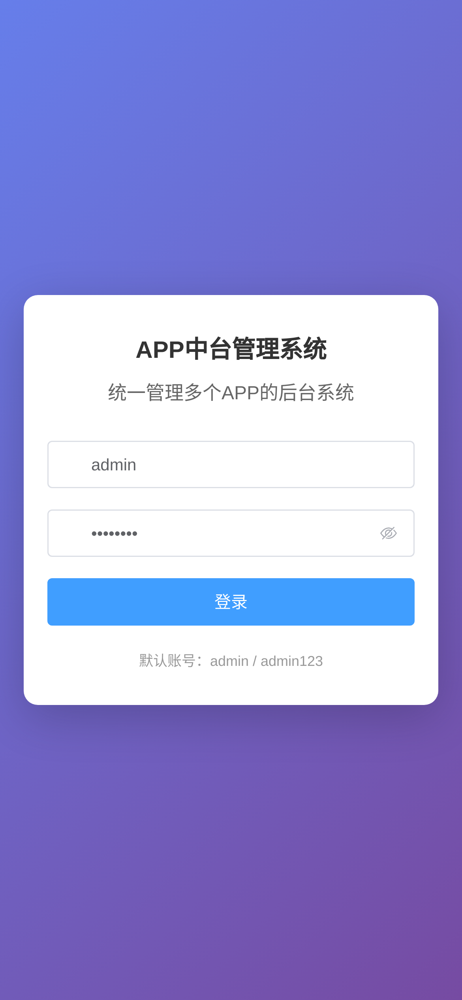
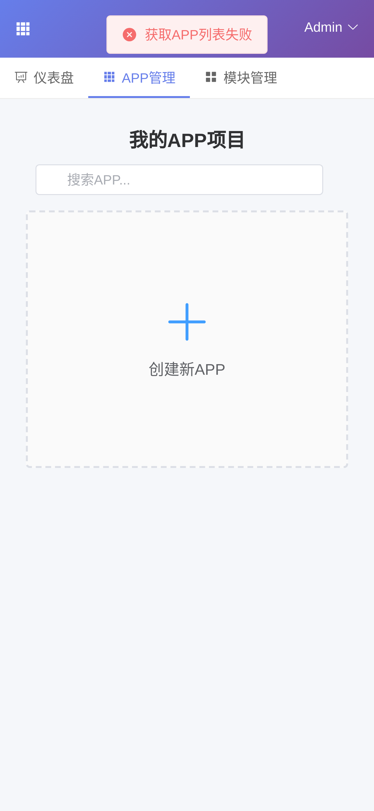
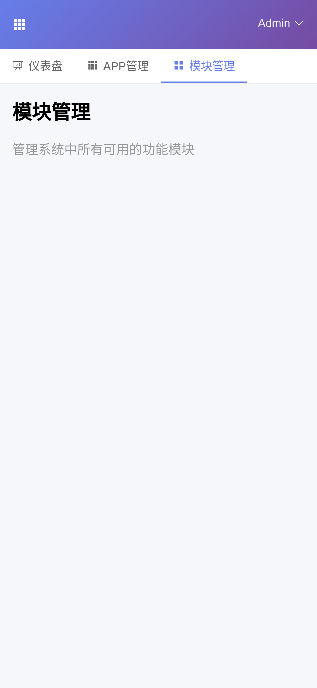
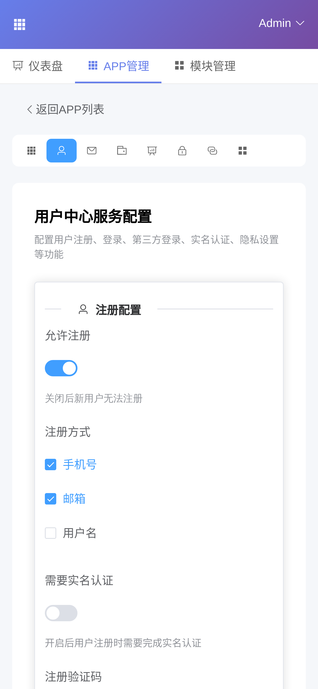
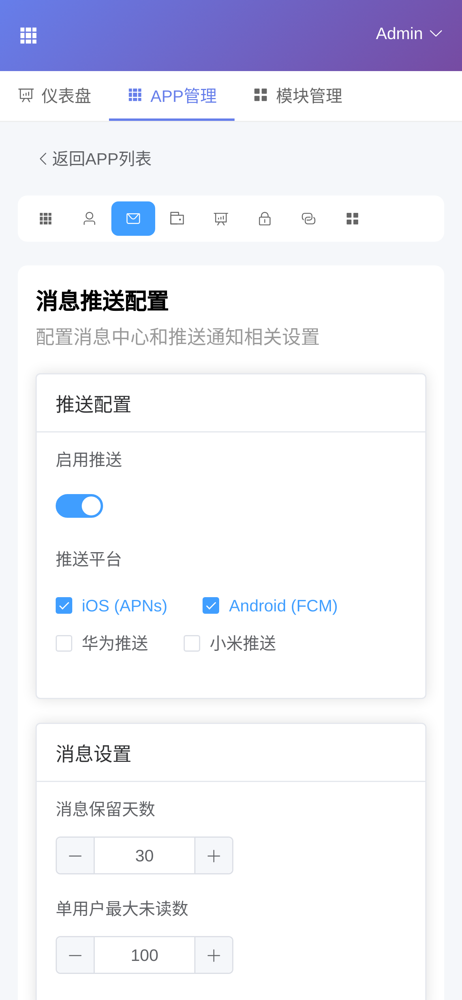
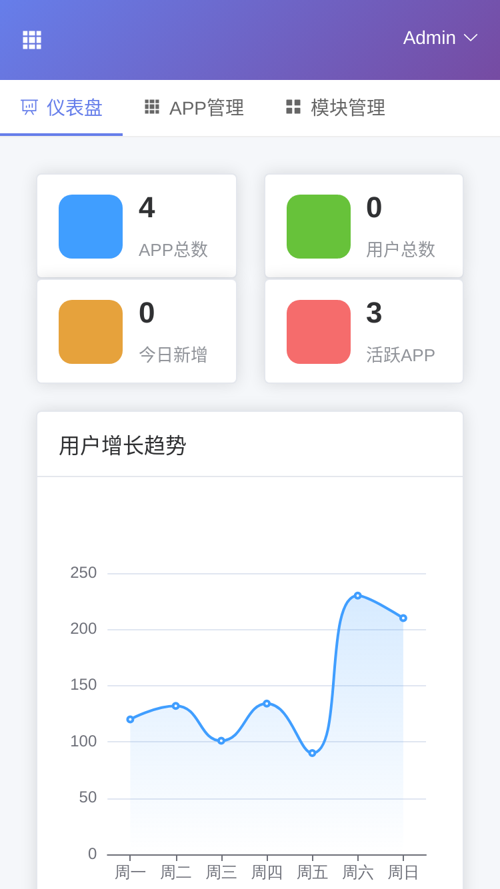
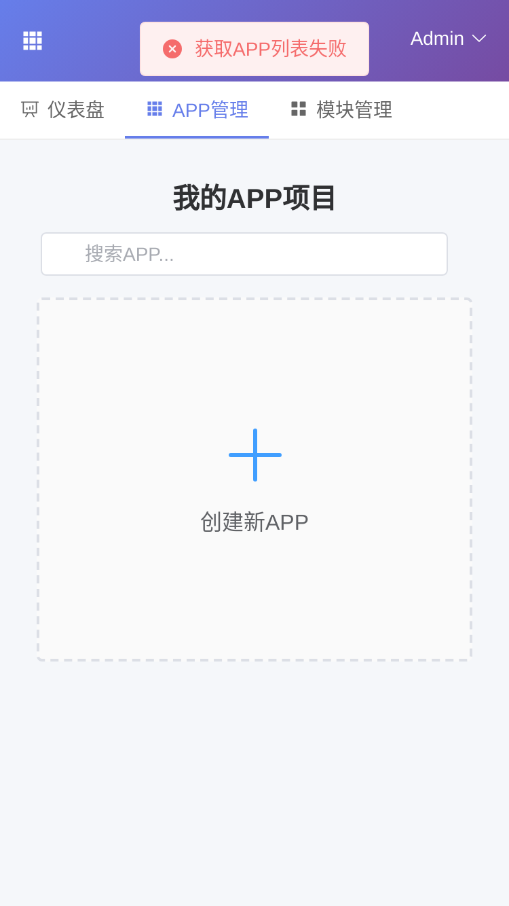
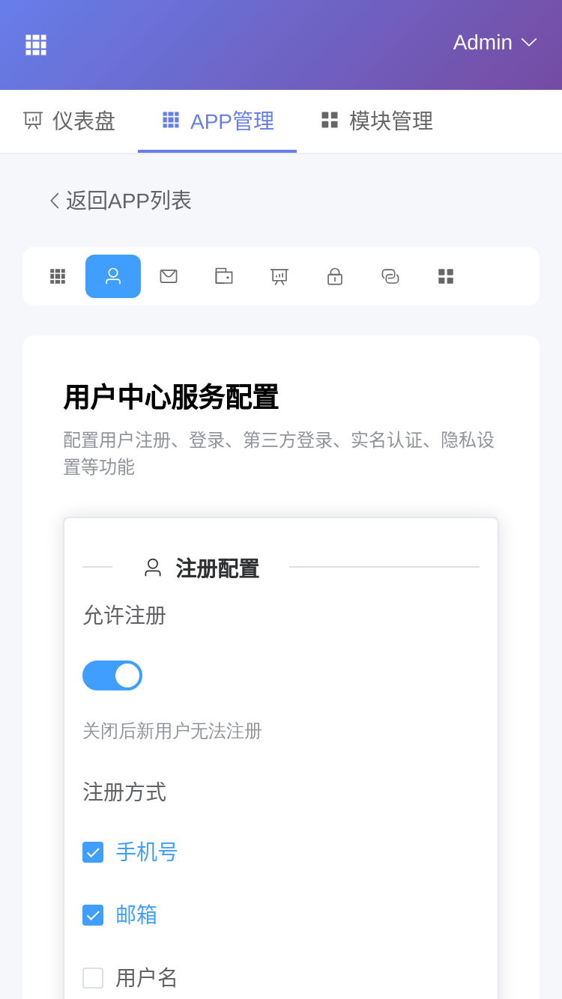
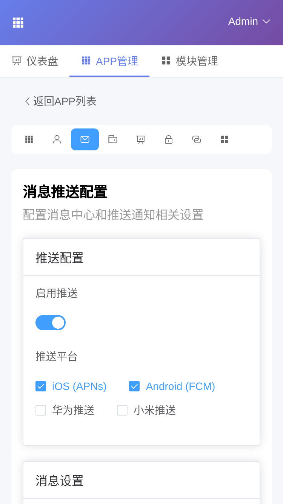
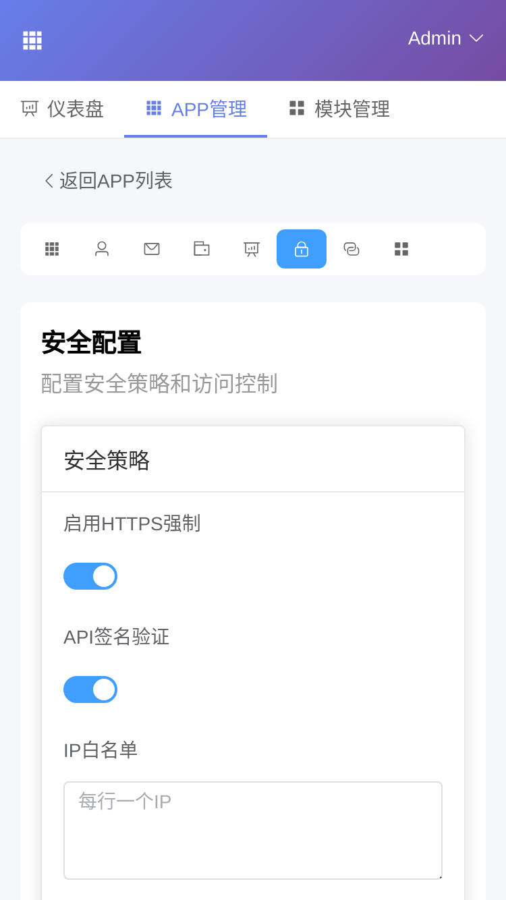

# 移动端模块界面测试报告

**测试时间**: 2026-01-08 21:34:02

## 测试概览

| 统计项 | 数量 |
|:---|:---|
| ✅ 通过 | 22 |
| ⚠️ 警告 | 2 |
| ❌ 失败 | 0 |
| **总计** | 24 |

## 测试设备

- **iPhone_12**: 390x844
- **iPhone_SE**: 375x667

## 详细结果

### iPhone_12

| 页面 | 状态 | 问题 |
|:---|:---|:---|
| 登录页面 | ✅ PASS | - |
| 仪表盘 | ✅ PASS | - |
| APP列表 | ✅ PASS | - |
| 模块管理 | ✅ PASS | - |
| APP配置-概览 | ✅ PASS | - |
| APP配置-用户中心 | ✅ PASS | - |
| APP配置-消息推送 | ✅ PASS | - |
| APP配置-支付 | ✅ PASS | - |
| APP配置-数据统计 | ✅ PASS | - |
| APP配置-安全 | ✅ PASS | - |
| APP配置-版本 | ⚠️ WARNING | 溢出元素: ['DIV.el-table__header-wrapper', 'DIV.el-scrollbar__wrap el-scrollbar__wrap--hidden-default'] |
| APP配置-模块 | ✅ PASS | - |

### iPhone_SE

| 页面 | 状态 | 问题 |
|:---|:---|:---|
| 登录页面 | ✅ PASS | - |
| 仪表盘 | ✅ PASS | - |
| APP列表 | ✅ PASS | - |
| 模块管理 | ✅ PASS | - |
| APP配置-概览 | ✅ PASS | - |
| APP配置-用户中心 | ✅ PASS | - |
| APP配置-消息推送 | ✅ PASS | - |
| APP配置-支付 | ✅ PASS | - |
| APP配置-数据统计 | ✅ PASS | - |
| APP配置-安全 | ✅ PASS | - |
| APP配置-版本 | ⚠️ WARNING | 溢出元素: ['DIV.el-table__header-wrapper', 'DIV.el-scrollbar__wrap el-scrollbar__wrap--hidden-default'] |
| APP配置-模块 | ✅ PASS | - |

## 截图

### iPhone_12

#### 登录页面

#### 仪表盘

#### APP列表

#### 模块管理

#### APP配置-概览

#### APP配置-用户中心

#### APP配置-消息推送

#### APP配置-支付

#### APP配置-数据统计

#### APP配置-安全

#### APP配置-版本

#### APP配置-模块

### iPhone_SE

#### 登录页面

#### 仪表盘

#### APP列表

#### 模块管理

#### APP配置-概览

#### APP配置-用户中心

#### APP配置-消息推送

#### APP配置-支付

#### APP配置-数据统计

#### APP配置-安全

#### APP配置-版本

#### APP配置-模块

